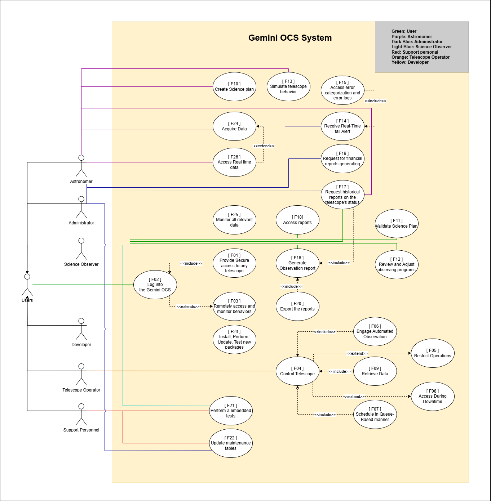

# Use Case Diagram  

  

 
📌 **Click the image** to view it in the repository.  
🔗 **Or access the diagram here:** [Click here](https://drive.google.com/file/d/1d1ErUXj15VuybF0XfAjOHoKt5g2jQZVK/view?usp=sharing)  

---
## Overview
The Gemini OCS system use case diagram defines different roles and their access to various functionalities within the system. There are **seven** primary roles, each with different levels of access and responsibilities.

## User Roles and Access

### 1. **User**
   - After logging in successfully (**[F02]**), the system provides access to:
     - Secure access to any telescope (**[F01]**)
     - Optional remote access and monitoring (**[F03]**)
     - Monitoring all relevant data (**[F25]**)
     - Accessing reports (**[F18]**)
     - Generating observation reports (**[F16]**)
     - Exporting reports (**[F20]**)
     - Validating the science plan (**[F11]**)
     - Requesting historical reports on the telescope’s status (**[F17]**)
     - Reviewing and adjusting the observing program (**[F12]**)
    
### 2. **Astronomer**
   - Responsible for **science planning and data analysis**.
   - Has access to:
     - Create Science Plan (**[F10]**)
     - Simulate telescope behavior (**[F13]**)
     - Data acquisition, including access real-time data (**[F24,26]**)
     - Request historical reports on the telescope’s status (**[F17]**)
     
### 3. **Administrator**
   - Responsible for **system access management, security, and data integrity**.
   - Has access to:
     - Receive real-time failure alerts, including access to error categorization and logs (**[F14, F15]**)
     - Request historical reports on the telescope’s status (**[F17]**)
     - Request for financial report (**[F19]**)
     - Update maintenance tables (**[F22]**)
       
### 4. **Science Observer**  
   - Responsible for **monitoring telescope operations and verifying observation data**.  
   - Has access to:  
     - Perform an embedded test (**[F21]**)
       
### 5. **Developer**  
   - Responsible for **maintaining and improving the system through software updates and testing**.  
   - Has access to:  
     - Support telescope control functionalities (**[F04]**)
     - Assist in telescope automation (**[F06]**)
     - Install, perform, update, and test new software packages (**[F23]**)
       
 ### 6. **Telescope Operator**  
   - Responsible for **operating and managing the telescope, ensuring smooth functionality**.  
   - Has access to:  
     - Telescope control (**[F04]**)
     - Manage queue-based scheduling (**[F07]**)
     - Schedule and access planned downtimes (**[F08]**)
     - Retrieve observational data (**[F09]**)
     - Perform embedded tests to verify system performance (**[F21]**)
       
 ### 7. **Support Personnel**  
   - Responsible for **maintaining system infrastructure and ensuring operational stability**.  
   - Has access to:  
     - Update maintenance tables (**[F22]**)
