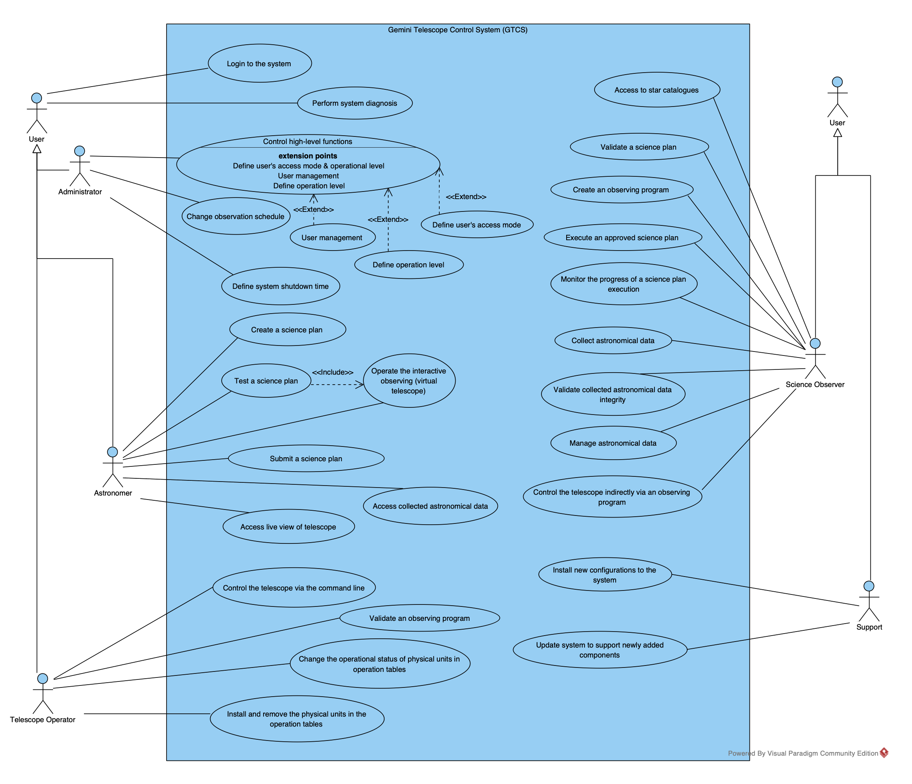
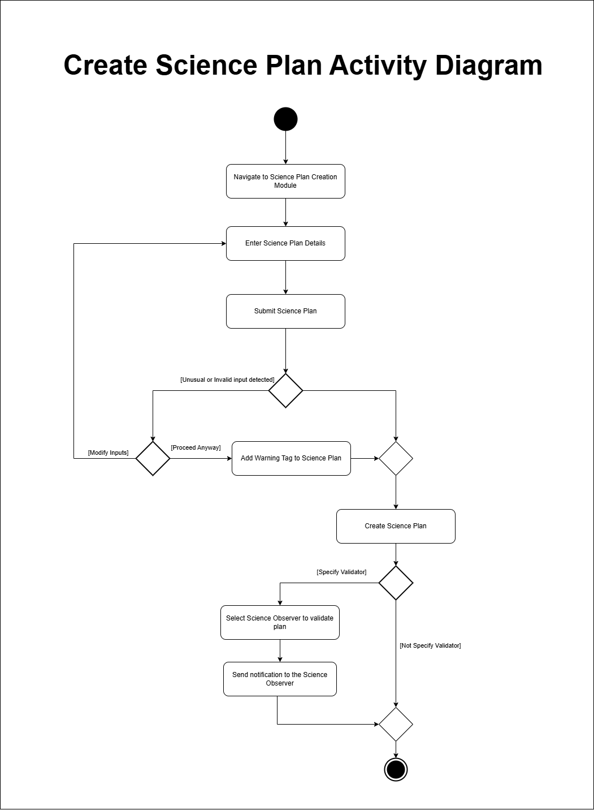
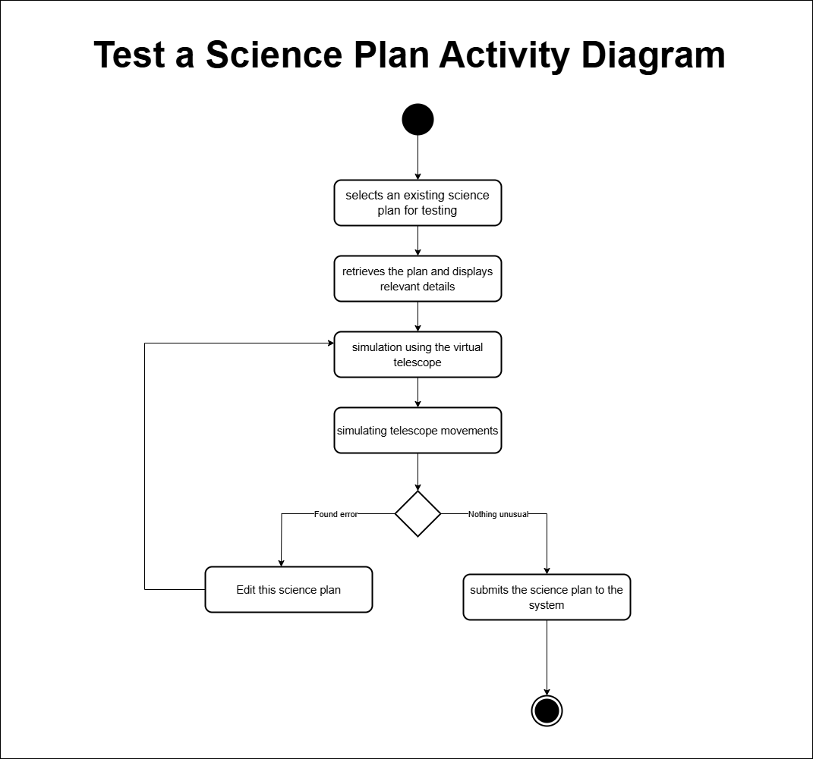
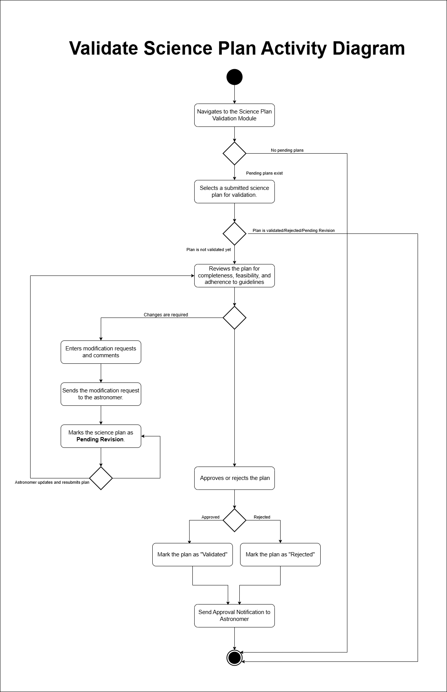
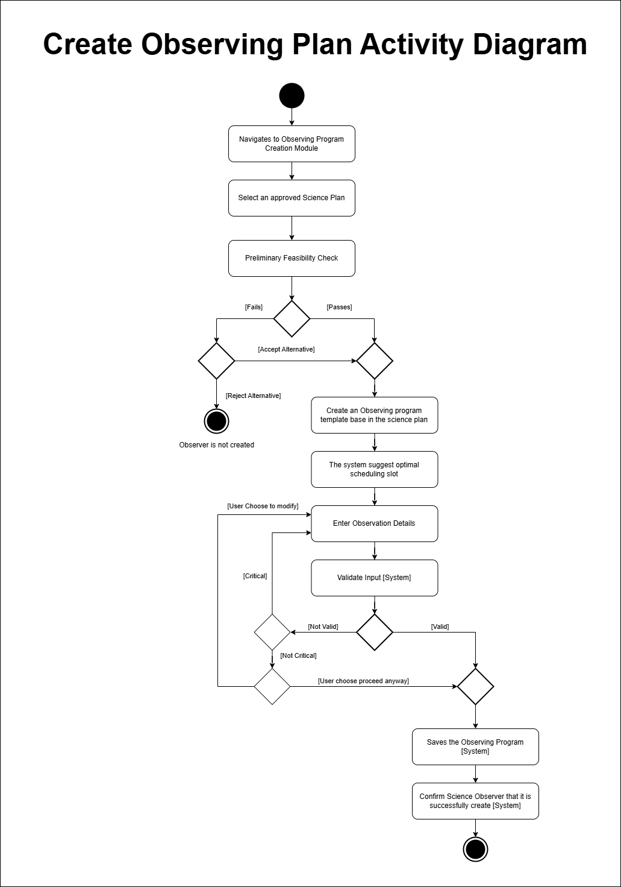
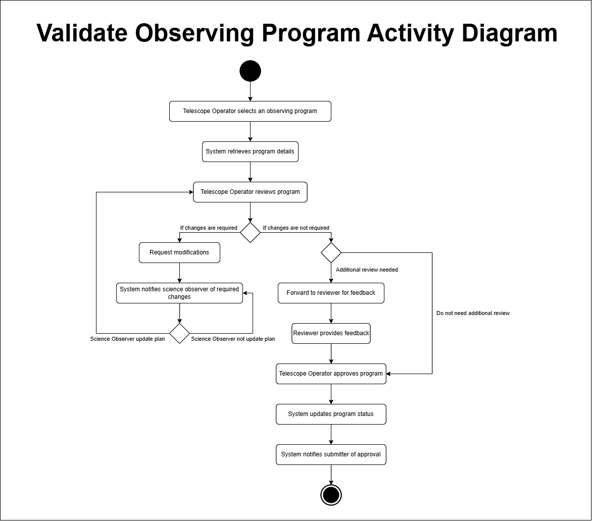

# Gemini8 - Delivery 3
---

## Use Case Diagram

### Selected Use Cases
From the final use case diagram, we have selected the following 5 use cases:

1. **Create Science Plan**
2. **Test Science Plan**
3. **Validate Science Plan**
4. **Create Observing Program**
5. **Validate Observing Program**

--- 
## Use Case Descriptions: Create Science Plan

<table>
  <tr>
    <td><strong>Use Case name:</strong> Create Science Plan</td>
    <td><strong>ID: 1</strong></td>
    <td><strong>Importance Level:</strong> High</td>
  </tr>
  <tr>
    <td colspan="2"> <strong> Primary Actor: </strong> Astronomer</td>
    <td> <strong>Use Case Type:</strong> Scientific Process</td>
  </tr>
  <tr>
    <td colspan="3">
        <strong>Stakeholders and Interests</strong>
        <ul style="list-style-type: none; padding-left: 20px;">
            <li><strong>Astronomer</strong> – Wants to create a science plan for observing desired astronomical data.</li>
            <li><strong>Science Observer</strong> – Must validate and execute the science plan in observation plans they create.</li>
            <li><strong>Administrator</strong> – Manages permissions for modifying and accessing existing science plans.</li>
        </ul>
    </td>
    </tr>
    <tr>
        <td colspan="3"><strong>Brief Description</strong> This use case demonstrates the process of creating a science plan, which will be used in an observation plan to collect astronomical data.</td>
    </tr>
    <tr>
        <td colspan="3"><strong>Trigger</strong> The astronomer wishes to create a science plan to collect astronomical data.</td>
    </tr>
    <tr>
        <td colspan="3"><strong>Type</strong> Internal</td>
    </tr>
    <tr>
        <td colspan="3">
            <strong>Relationships</strong> 
            <strong>Association:</strong> Astronomer 
            <strong>Include:</strong> None 
            <strong>Extend:</strong> None 
            <strong>Generalization:</strong> None
        </td>
    </tr>
    <tr>
        <td colspan="3"><strong>Normal Flow of Events</strong> 
        <ol style="padding-left: 40px;">
            <li>The astronomer navigates to the science plan creation module.</li>
            <li>The astronomer enters required details for the science plan creation.</li>
            <li>The astronomer submits the completed science plan.</li>
            <li>The Science plan creation module verifies and checks the submitted science plan.</li>
            <li>The Science plan creation module creates a science plan and stores it.</li>
            <li>If the astronomer would like to specify a science observer to validate the science plan:</li>
            <ul>
                <li>The <strong>S-1: Request Validation</strong> subflow is performed.</li>
            </ul>
        </ol>
        </td>
    </tr>
    <tr>
    <td colspan="3"><strong>Subflows</strong> 
        <strong>S-1: Request Validation</strong>
        <ol style="padding-left: 40px;">
            <li>The Science plan creation module prompts the astronomer to provide the identifier of the science observer to validate the science plan.</li>
            <li>The Science plan creation module searches for the science observer that matches the identifier.</li>
            <li>The Science plan creation module sends a notification to the observer about the validation request.</li>
        </ol>
    </td>
</tr>
<tr>
    <td colspan="3"><strong>Alternate / Exceptional Flow</strong> 
        <strong>4, a:</strong> If the Science plan creation module detects unusual or invalid inputs, it performs an alternate flow:
        <ol style="padding-left: 60px;">
            <li>The Science plan creation module displays a warning message specifying the detected issue(s).</li>
            <li>The astronomer is given two options:</li>
            <ul>
                <li><strong>Option 1:</strong> Modify Inputs – The astronomer is redirected to the input fields for correction.</li>
                <li><strong>Option 2:</strong> Proceed Anyway – The system tags the science plan with a warning and proceeds.</li>
            </ul>
        </ol>
    </td>
</tr>
</table>

---

### Use Case Description: Test Science Plan

<table>
  <tr>
    <td><strong>Use Case name:</strong> Test a Science Plan</td>
    <td><strong>ID: 2</strong></td>
    <td><strong>Importance Level:</strong> High</td>
  </tr>
  <tr>
    <td colspan="2"> <strong> Primary Actor: </strong> Astronomer</td>
    <td> <strong>Use Case Type:</strong> Testing</td>
  </tr>
  <tr>
    <td colspan="3">
        <strong>Stakeholders and Interests</strong>
        <ul style="list-style-type: none; padding-left: 20px;">
            <li><strong>Astronomer</strong> – Wants to ensure the science plan is correctly designed before submission.</li>
            <li><strong>Science Observer</strong> – Ensures the science plan meets the required observational and operational standards before execution.</li>
        </ul>
    </td>
  </tr>
  <tr>
    <td colspan="3"><strong>Brief Description</strong> This use case allows an astronomer to test a prepared science plan using the interactive observing system (virtual telescope) to check its feasibility before submission to the system.</td>
  </tr>
  <tr>
    <td colspan="3"><strong>Trigger</strong> The astronomer has created a science plan.</td>
  </tr>
  <tr>
    <td colspan="3"><strong>Type</strong> Internal</td>
  </tr>
  <tr>
    <td colspan="3">
        <strong>Relationships</strong> 
        <strong>Association:</strong> Astronomer 
        <strong>Include:</strong> Operate the Interactive Observing (Virtual Telescope) 
        <strong>Extend:</strong> None 
        <strong>Generalization:</strong> None
    </td>
  </tr>
  <tr>
    <td colspan="3"><strong>Normal Flow of Events</strong> 
        <ol style="padding-left: 40px;">
            <li>The astronomer selects a science plan for testing.</li>
            <li>The system retrieves the plan and displays relevant details, including observation sequences, telescope settings, and estimated execution time.</li>
            <li>The astronomer initiates the simulation using the virtual telescope.</li>
            <li>The system processes the plan, simulating telescope movements, data collection, and environmental conditions.</li>
            <li>If errors or inefficiencies are detected:</li>
            <li>If the plan works correctly, the astronomer submits the science plan to the system.</li>
        </ol>
    </td>
  </tr>
  <tr>
    <td colspan="3"><strong>Subflows</strong> 
        <strong>None</strong>
    </td>
  </tr>
  <tr>
    <td colspan="3"><strong>Alternate / Exceptional Flow</strong> 
        <strong>5a:</strong> Modify the science plan and test by simulation using the virtual telescope. Check the result.
    </td>
  </tr>
</table>

---

### Use Case Description: Validate Science Plan

<table>
  <tr>
    <td><strong>Use Case name:</strong> Validate Science Plan</td>
    <td><strong>ID: 3</strong></td>
    <td><strong>Importance Level:</strong> High</td>
  </tr>
  <tr>
    <td colspan="2"> <strong> Primary Actor: </strong> Science Observer</td>
    <td> <strong>Use Case Type:</strong> Validation</td>
  </tr>
  <tr>
    <td colspan="3">
        <strong>Stakeholders and Interests</strong>
        <ul style="list-style-type: none; padding-left: 20px;">
            <li><strong>Science Observer</strong> – Ensures that the science plan meets the required observational and operational standards before execution.</li>
            <li><strong>Astronomer</strong> – Relies on validation to proceed with observations.</li>
            <li><strong>Administrator</strong> – Ensures compliance with institutional policies and system integrity.</li>
        </ul>
    </td>
  </tr>
  <tr>
    <td colspan="3"><strong>Brief Description</strong> This use case describes the process of a science observer validating a submitted science plan before it is approved for execution.</td>
  </tr>
  <tr>
    <td colspan="3"><strong>Trigger</strong> A science plan is submitted by an astronomer for review.</td>
  </tr>
  <tr>
    <td colspan="3"><strong>Type</strong> Internal</td>
  </tr>
  <tr>
    <td colspan="3">
        <strong>Relationships</strong> 
        <strong>Association:</strong> Science Observer 
        <strong>Include:</strong> None 
        <strong>Extend:</strong> None 
        <strong>Generalization:</strong> None
    </td>
  </tr>
  <tr>
    <td colspan="3"><strong>Normal Flow of Events</strong> 
        <ol style="padding-left: 40px;">
            <li>The science observer navigates to the Science Plan Validation Module.</li>
            <li>The science observer selects a submitted science plan for validation.</li>
            <li>The system retrieves plans and displays relevant details.</li>
            <li>The observer selects a plan.</li>
            <li>If the plan is “validated”, “Pending Revision”, or “Rejected”, the system displays plan details and ends the process.</li>
            <li>If the plan status is “not validated”, the observer reviews the plan for completeness, feasibility, and adherence to guidelines.</li>
            <li>If changes are required:</li>
            <ul>
                <li>The <strong>S-1: Request Modifications</strong> subflow is performed.</li>
            </ul>
            <li>The science observer approves or rejects the plan.</li>
            <li>If the plan is approved, its status updates to "Validated".</li>
            <li>If the plan is rejected, its status updates to "Rejected".</li>
            <li>The system updates the status of the science plan.</li>
        </ol>
    </td>
  </tr>
  <tr>
    <td colspan="3"><strong>Subflows</strong> 
        <strong>S-1: Request Modifications</strong>
        <ol style="padding-left: 40px;">
            <li>The science observer enters modification requests and comments.</li>
            <li>The system sends the modification request to the astronomer.</li>
            <li>The system marks the science plan as Pending Revision.</li>
            <li>The astronomer updates and resubmits it for validation.</li>
        </ol>
    </td>
  </tr>
  <tr>
    <td colspan="3"><strong>Alternate / Exceptional Flow</strong> 
        <strong>2,a1:</strong> There are no pending science plans available for review. 
        <strong>7,a2:</strong> The science plan has already been validated by another observer.
    </td>
  </tr>
</table>

---

### Use Case Description: Create an Observing Program
<table>
  <tr>
    <td><strong>Use Case name:</strong> Create an Observing Program</td>
    <td><strong>ID: 4</strong></td>
    <td><strong>Importance Level:</strong> High</td>
  </tr>
  <tr>
    <td colspan="2">Primary Actor: Telescope Operator</td>
    <td>Use Case Type: Program Creation</td>
  </tr>
  <tr>
    <td colspan="3">
        <strong>Stakeholders and Interests</strong>
        <ul style="list-style-type: none; padding-left: 20px;">
            <li><strong>Telescope Operator</strong> – Wants to create an observing program to execute a science plan.</li>
            <li><strong>Astronomer</strong> – Ensures that the created observing program aligns with the science objectives.</li>
            <li><strong>Science Observer</strong> – Needs to understand how the observing program relates to overall observations.</li>
        </ul>
    </td>
  </tr>
  <tr>
    <td colspan="3"><strong>Brief Description</strong> This use case describes how a telescope operator creates an observing program based on validated science plans and prepares for execution.</td>
  </tr>
  <tr>
    <td colspan="3"><strong>Trigger</strong> The telescope operator wants to create an observing program.</td>
  </tr>
  <tr>
    <td colspan="3"><strong>Type</strong> Internal</td>
  </tr>
  <tr>
    <td colspan="3">
        <strong>Relationships</strong> 
        <strong>Association:</strong> Telescope Operator 
        <strong>Include:</strong> Validate Science Plan 
        <strong>Extend:</strong> None 
        <strong>Generalization:</strong> None
    </td>
  </tr>
  <tr>
    <td colspan="3"><strong>Normal Flow of Events</strong> 
        <ol style="padding-left: 40px;">
            <li>The telescope operator accesses the Observing Program Creation Module.</li>
            <li>The telescope operator selects a validated science plan to base the observing program on.</li>
            <li>The telescope operator enters relevant details, such as the start time, duration, and observational parameters.</li>
            <li>The system verifies the provided information.</li>
            <li>If valid, the telescope operator submits the observing program.</li>
            <li>The system stores the observing program and notifies the telescope operator of success.</li>
        </ol>
    </td>
  </tr>
  <tr>
    <td colspan="3"><strong>Subflows</strong> 
        <strong>None</strong>
    </td>
  </tr>
  <tr>
    <td colspan="3"><strong>Alternate / Exceptional Flow</strong> 
        <strong>4, a:</strong> If any required information is missing or incorrect, the system prompts the telescope operator to correct it before submission.
    </td>
  </tr>
</table>

---

### Use Case Description: Validate an Observing Program
<table>
  <tr>
    <td><strong>Use Case name:</strong> Validate an Observing Program</td>
    <td><strong>ID: 5</strong></td>
    <td><strong>Importance Level:</strong> High</td>
  </tr>
  <tr>
    <td colspan="2">Primary Actor: Telescope Operator</td>
    <td>Use Case Type: Validation</td>
  </tr>
  <tr>
    <td colspan="3">
        <strong>Stakeholders and Interests</strong>
        <ul style="list-style-type: none; padding-left: 20px;">
            <li><strong>Telescope Operator</strong> – Ensures that the observing program meets the required standards.</li>
            <li><strong>Astronomers</strong> – Rely on validated observing programs for accurate scientific observations.</li>
            <li><strong>Science Observers</strong> – Need validated programs to ensure reliable data collection.</li>
        </ul>
    </td>
  </tr>
  <tr>
    <td colspan="3"><strong>Brief Description</strong> This use case describes the process of the Telescope Operator reviewing and validating an observing program to ensure it meets operational and scientific requirements before execution.</td>
  </tr>
  <tr>
    <td colspan="3"><strong>Trigger</strong> A new observing program is submitted for validation.</td>
  </tr>
  <tr>
    <td colspan="3"><strong>Type</strong> Internal</td>
  </tr>
  <tr>
    <td colspan="3">
        <strong>Relationships</strong> 
        <strong>Association:</strong> Telescope Operator 
        <strong>Include:</strong> None 
        <strong>Extend:</strong> None 
        <strong>Generalization:</strong> None
    </td>
  </tr>
  <tr>
    <td colspan="3"><strong>Normal Flow of Events</strong> 
        <ol style="padding-left: 40px;">
            <li>The telescope operator accesses the system.</li>
            <li>The system retrieves the observing program details.</li>
            <li>The telescope operator selects an observing program for validation.</li>
            <li>The telescope operator reviews the program for completeness and accuracy.</li>
            <li>If changes are required:</li>
            <ul>
                <li>The <strong>S-1: Request for Modifications</strong> subflow is performed.</li>
            </ul>
            <li>If additional expertise is needed:</li>
            <ul>
                <li>The <strong>S-2: Additional Review</strong> subflow is performed.</li>
            </ul>
            <li>If the program meets all validation criteria, the telescope operator approves it.</li>
            <li>The system marks the program as validated and updates the status.</li>
            <li>The science observer is notified of the validation result.</li>
        </ol>
    </td>
  </tr>
  <tr>
    <td colspan="3"><strong>Subflows</strong> 
        <strong>S-1: Request for Modifications</strong>
        <ol style="padding-left: 40px;">
            <li>The system prompts the telescope operator with request modification.</li>
            <li>The system sends the program back to the science observer with feedback.</li>
        </ol>
        <strong>S-2: Additional Review</strong>
        <ol style="padding-left: 40px;">
            <li>If required, the telescope operator can forward the program to another expert for further review.</li>
            <li>The reviewer provides feedback or confirms validation.</li>
        </ol>
    </td>
  </tr>
  <tr>
    <td colspan="3"><strong>Alternate / Exceptional Flow</strong> 
        <strong>3, a1:</strong> If the observing program does not meet the required criteria, the system rejects it, and the submitter is notified to revise and resubmit.
    </td>
  </tr>
</table>

---

## Activity Diagrams

📌 **Click the image** to view it in the repository.  
🔗 **Or access the diagram here:** [Click here]() 

 
 
 
 
 

---

## Sequence Diagrams

---

## Class Diagram

