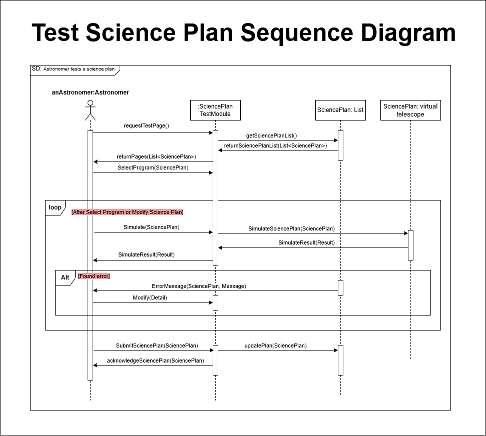

# Gemini8 - Delivery 3
---

## Use Case Diagram

### Selected Use Cases
From the final use case diagram, we have selected the following 5 use cases:

1. **Create Science Plan**
2. **Test Science Plan**
3. **Validate Science Plan**
4. **Create Observing Program**
5. **Validate Observing Program**

🔗 **Access the doc version here:** [Click here](https://docs.google.com/document/d/12EcK--yKIIMsJC57zrawP9R-AoOYYruRPwdzsgmrf0Y/edit?usp=sharing) 

--- 
## Use Case Descriptions: Create Science Plan

<table>
  <tr>
    <td><strong>Use Case name:</strong> Create Science Plan</td>
    <td><strong>ID: 1</strong></td>
    <td><strong>Importance Level:</strong> High</td>
  </tr>
  <tr>
    <td colspan="2"> <strong> Primary Actor: </strong> Astronomer</td>
    <td> <strong>Use Case Type:</strong> Scientific Process</td>
  </tr>
  <tr>
    <td colspan="3">
        <strong>Stakeholders and Interests</strong>
        <ul style="list-style-type: none; padding-left: 20px;">
            <li><strong>Astronomer</strong> – Wants to create a science plan for observing desired astronomical data.</li>
            <li><strong>Science Observer</strong> – Must validate and execute the science plan in observation plans they create.</li>
            <li><strong>Administrator</strong> – Manages permissions for modifying and accessing existing science plans.</li>
        </ul>
    </td>
    </tr>
    <tr>
        <td colspan="3"><strong>Brief Description</strong> This use case demonstrates the process of creating a science plan, which will be used in an observation plan to collect astronomical data.</td>
    </tr>
    <tr>
        <td colspan="3"><strong>Trigger</strong> The astronomer wishes to create a science plan to collect astronomical data.</td>
    </tr>
    <tr>
        <td colspan="3"><strong>Type</strong> Internal</td>
    </tr>
    <tr>
        <td colspan="3">
            <strong>Relationships</strong> 
            <strong>Association:</strong> Astronomer 
            <strong>Include:</strong> None 
            <strong>Extend:</strong> None 
            <strong>Generalization:</strong> None
        </td>
    </tr>
    <tr>
        <td colspan="3"><strong>Normal Flow of Events</strong> 
        <ol style="padding-left: 40px;">
            <li>The astronomer navigates to the science plan creation module.</li>
            <li>The astronomer enters required details for the science plan creation.</li>
            <li>The astronomer submits the completed science plan.</li>
            <li>The Science plan creation module verifies and checks the submitted science plan.</li>
            <li>The Science plan creation module creates a science plan and stores it.</li>
            <li>If the astronomer would like to specify a science observer to validate the science plan:</li>
            <ul>
                <li>The <strong>S-1: Request Validation</strong> subflow is performed.</li>
            </ul>
        </ol>
        </td>
    </tr>
    <tr>
    <td colspan="3"><strong>Subflows</strong> 
        <strong>S-1: Request Validation</strong>
        <ol style="padding-left: 40px;">
            <li>The Science plan creation module prompts the astronomer to provide the identifier of the science observer to validate the science plan.</li>
            <li>The Science plan creation module searches for the science observer that matches the identifier.</li>
            <li>The Science plan creation module sends a notification to the observer about the validation request.</li>
        </ol>
    </td>
</tr>
<tr>
    <td colspan="3"><strong>Alternate / Exceptional Flow</strong> 
    <strong>4, a:</strong> If the Science Plan Creation module detects unusual or invalid inputs, it performs an alternate flow:  
    <strong>4, a1:</strong> The Science plan creation module displays a warning message specifying the detected issue(s).  
    <strong>4, a2:</strong> The astronomer is given two options:  
    <ol style="">
        <ol><strong>Option 1:</strong> Modify Inputs  
              <ol style="padding-left: 30px;">
                        4, a3.1: The astronomer is redirected to the input fields for correction.
              </ol>
        </ol>
        <ol><strong>Option 2:</strong> Proceed Anyway  
              <ol style="padding-left: 30px;">
                        4, a3.2:The system tags the science plan with a warning and proceeds.
              </ol>
        </ol>
    </ol>
    
</td>

</tr>
</table>

---

### Use Case Description: Test Science Plan

<table>
  <tr>
    <td><strong>Use Case name:</strong> Test a Science Plan</td>
    <td><strong>ID: 2</strong></td>
    <td><strong>Importance Level:</strong> High</td>
  </tr>
  <tr>
    <td colspan="2"> <strong> Primary Actor: </strong> Astronomer</td>
    <td> <strong>Use Case Type:</strong> Testing</td>
  </tr>
  <tr>
    <td colspan="3">
        <strong>Stakeholders and Interests</strong>
        <ul style="list-style-type: none; padding-left: 20px;">
            <li><strong>Astronomer</strong> – Wants to ensure the science plan is correctly designed before submission.</li>
            <li><strong>Science Observer</strong> – Ensures the science plan meets the required observational and operational standards before execution.</li>
        </ul>
    </td>
  </tr>
  <tr>
    <td colspan="3"><strong>Brief Description</strong> This use case allows an astronomer to test a prepared science plan using the interactive observing system (virtual telescope) to check its feasibility before submission to the system.</td>
  </tr>
  <tr>
    <td colspan="3"><strong>Trigger</strong> The astronomer has created a science plan.</td>
  </tr>
  <tr>
    <td colspan="3"><strong>Type</strong> Internal</td>
  </tr>
  <tr>
    <td colspan="3">
        <strong>Relationships</strong> 
        <strong>Association:</strong> Astronomer 
        <strong>Include:</strong> Operate the Interactive Observing (Virtual Telescope) 
        <strong>Extend:</strong> None 
        <strong>Generalization:</strong> None
    </td>
  </tr>
  <tr>
    <td colspan="3"><strong>Normal Flow of Events</strong> 
        <ol style="padding-left: 40px;">
            <li>The astronomer selects a science plan for testing.</li>
            <li>The system retrieves the plan and displays relevant details, including observation sequences, telescope settings, and estimated execution time.</li>
            <li>The astronomer initiates the simulation using the virtual telescope.</li>
            <li>The system processes the plan, simulating telescope movements, data collection, and environmental conditions.</li>
            <li>If errors or inefficiencies are detected:</li>
            <li>If the plan works correctly, the astronomer submits the science plan to the system.</li>
        </ol>
    </td>
  </tr>
  <tr>
    <td colspan="3"><strong>Subflows</strong> 
        <strong>None</strong>
    </td>
  </tr>
  <tr>
    <td colspan="3"><strong>Alternate / Exceptional Flow</strong> 
        <strong>5a:</strong> Modify the science plan and test by simulation using the virtual telescope. Check the result.
    </td>
  </tr>
</table>

---

### Use Case Description: Validate Science Plan

<table>
  <tr>
    <td><strong>Use Case name:</strong> Validate Science Plan</td>
    <td><strong>ID: 3</strong></td>
    <td><strong>Importance Level:</strong> High</td>
  </tr>
  <tr>
    <td colspan="2"> <strong> Primary Actor: </strong> Science Observer</td>
    <td> <strong>Use Case Type:</strong> Validation</td>
  </tr>
  <tr>
    <td colspan="3">
        <strong>Stakeholders and Interests</strong>
        <ul style="list-style-type: none; padding-left: 20px;">
            <li><strong>Science Observer</strong> – Ensures that the science plan meets the required observational and operational standards before execution.</li>
            <li><strong>Astronomer</strong> – Relies on validation to proceed with observations.</li>
            <li><strong>Administrator</strong> – Ensures compliance with institutional policies and system integrity.</li>
        </ul>
    </td>
  </tr>
  <tr>
    <td colspan="3"><strong>Brief Description</strong> This use case describes the process of a science observer validating a submitted science plan before it is approved for execution.</td>
  </tr>
  <tr>
    <td colspan="3"><strong>Trigger</strong> A science plan is submitted by an astronomer for review.</td>
  </tr>
  <tr>
    <td colspan="3"><strong>Type</strong> Internal</td>
  </tr>
  <tr>
    <td colspan="3">
        <strong>Relationships</strong> 
        <strong>Association:</strong> Science Observer 
        <strong>Include:</strong> None 
        <strong>Extend:</strong> None 
        <strong>Generalization:</strong> None
    </td>
  </tr>
  <tr>
    <td colspan="3"><strong>Normal Flow of Events</strong> 
    <ol style="padding-left: 40px;">
        <li>The science observer navigates to the Science Plan Validation Module.</li>
        <li>The science observer selects a submitted science plan for validation.</li>
        <li>The system retrieves plans and displays relevant details.</li>
        <li>
            The observer selects a plan.
            <ol >
                a. If the plan is “Validated”, “Pending Revision”, or “Rejected”, the system displays plan details and ends the process.  
                b. If the plan status is “Not Validated”, pass  
            </ol>
        </li>
        <li>
        the observer reviews the plan for completeness, feasibility, and adherence to guidelines.
        </li>
        <li>
            If changes are required:
            <ul>
                <li>The <strong>S-1: Request Modifications</strong> subflow is performed.</li>
            </ul>
        </li>
        <li>The science observer approves or rejects the plan.
          <ol >
                a. If the plan is approved, its status updates to "Validated".  
                b. If the plan is rejected, its status updates to "Rejected". 
            </ol>
        </li>
        <li>The system updates the status of the science plan.</li>
    </ol>
</td>

  </tr>
  <tr>
    <td colspan="3"><strong>Subflows</strong> 
        <strong>S-1: Request Modifications</strong>
        <ol style="padding-left: 40px;">
            <li>The science observer enters modification requests and comments.</li>
            <li>The system sends the modification request to the astronomer.</li>
            <li>The system marks the science plan as Pending Revision.</li>
            <li>The astronomer updates and resubmits it for validation.</li>
        </ol>
    </td>
  </tr>
  <tr>
    <td colspan="3"><strong>Alternate / Exceptional Flow</strong> 
        <strong>2,a1:</strong> There are no pending science plans available for review. 
        <strong>7,a2:</strong> The science plan has already been validated by another observer.
    </td>
  </tr>
</table>

---

### Use Case Description: Create an Observing Program
<table>
  <tr>
    <td><strong>Use Case name:</strong> Create an Observing Program</td>
    <td><strong>ID: 4</strong></td>
    <td><strong>Importance Level:</strong> High</td>
  </tr>
  <tr>
    <td colspan="2">Primary Actor: Science Observer</td>
    <td>Use Case Type: Creation</td>
  </tr>
  <tr>
    <td colspan="3">
        <strong>Stakeholders and Interests</strong>
        <ul style="list-style-type: none; padding-left: 20px;">
            <li><strong>Science Observer</strong> – Wants to create an observing program to manage and schedule observations.</li>
            <li><strong>Astronomer</strong> – Utilizes the observing program to align science goals with telescope operations.</li>
            <li><strong>Telescope Operator</strong> – Ensures the observing program is feasible and aligns with telescope capabilities.</li>
            <li><strong>Administrator</strong> – Manages permissions and access to observing programs.</li>
        </ul>
    </td>
  </tr>
  <tr>
    <td colspan="3"><strong>Brief Description</strong> This use case describes the process of creating an observing program, which defines the structure, schedule, and objectives for telescope observations.</td>
  </tr>
  <tr>
    <td colspan="3"><strong>Trigger</strong> The Science Observer initiates the process to create an observing program for telescope observations.</td>
  </tr>
  <tr>
    <td colspan="3"><strong>Type</strong> Internal</td>
  </tr>
  <tr>
    <td colspan="3">
        <strong>Relationships</strong> 
        <strong>Association:</strong> Science Observer 
        <strong>Include:</strong> None 
        <strong>Extend:</strong> None 
        <strong>Generalization:</strong> None
    </td>
  </tr>
  <tr>
    <td colspan="3"><strong>Normal Flow of Events</strong> 
        <ol style="padding-left: 40px;">
            <li>The science observer navigates to the Observing Program Creation Module.</li>
            <li>The science observer selects an approved Science Plan.</li>
            <li>The system performs a Preliminary Feasibility Check to ensure the observation is possible.
            <ol >
                a. If the feasibility check fails, the system suggests modifications and alternative options. The process ends if the user does not accept an alternative.  
                b. If the feasibility check passes, the system automatically creates an Observing Program template based on the Science Plan.  
            </ol>
            </li>
            <li>The system automatically assigns a priority score and suggests optimal scheduling slots.</li>
            <li>The science observer enters observation details, including targets, time windows, instrument settings, and constraints.</li>
            <li>The system performs input validation to check for missing or incorrect information.
            <ol >
                a. If the validation fails, the S-1: Unusual Input Warning subflow is performed.  
                b. If all inputs are valid, the science observer saves the observing program.  
            </ol>
            </li>
            <li>The system confirms that the observing program has been successfully created.</li>
            <li>The process ends, waiting for further validation by telescope operators.</li>
        </ol>
    </td>
  </tr>
  <tr>
    <td colspan="3"><strong>Subflows</strong> 
        <strong>S-1: Unusual Input Warning</strong> 
        The system detects missing or unusual inputs in the observing program. The system displays a warning message specifying the issue(s). The science observer has two options:
        <ul style="list-style-type: none; padding-left: 20px;">
            <li><strong>Modify Inputs:</strong> The user corrects the input errors and revalidates.</li>
            <li><strong>Proceed Anyway:</strong> The system tags the observing program with a warning but allows saving (only if there are no critical errors).</li>
        </ul>
    </td>
  </tr>
  <tr>
    <td colspan="3"><strong>Alternate / Exceptional Flow</strong> 
        <strong>3, a:</strong> The observing program cannot be created because the target is not visible, the instrument is unavailable, or the telescope is under maintenance. The system provides alternative suggestions. If the science observer accepts an alternative, the process continues. If the science observer rejects all alternatives, the process ends. 
        <strong>6, a:</strong> The observing program contains critical errors that prevent validation. The system blocks submission until corrections are made.
    </td>
  </tr>
</table>

---

### Use Case Description: Validate an Observing Program
<table>
  <tr>
    <td><strong>Use Case name:</strong> Validate an Observing Program</td>
    <td><strong>ID: 5</strong></td>
    <td><strong>Importance Level:</strong> High</td>
  </tr>
  <tr>
    <td colspan="2">Primary Actor: Telescope Operator</td>
    <td>Use Case Type: Validation</td>
  </tr>
  <tr>
    <td colspan="3">
        <strong>Stakeholders and Interests</strong>
        <ul style="list-style-type: none; padding-left: 20px;">
            <li><strong>Telescope Operator</strong> – Ensures that the observing program meets the required standards.</li>
            <li><strong>Astronomers</strong> – Rely on validated observing programs for accurate scientific observations.</li>
            <li><strong>Science Observers</strong> – Need validated programs to ensure reliable data collection.</li>
        </ul>
    </td>
  </tr>
  <tr>
    <td colspan="3"><strong>Brief Description</strong> This use case describes the process of the Telescope Operator reviewing and validating an observing program to ensure it meets operational and scientific requirements before execution.</td>
  </tr>
  <tr>
    <td colspan="3"><strong>Trigger</strong> A new observing program is submitted for validation.</td>
  </tr>
  <tr>
    <td colspan="3"><strong>Type</strong> Internal</td>
  </tr>
  <tr>
    <td colspan="3">
        <strong>Relationships</strong> 
        <strong>Association:</strong> Telescope Operator 
        <strong>Include:</strong> None 
        <strong>Extend:</strong> None 
        <strong>Generalization:</strong> None
    </td>
  </tr>
  <tr>
    <td colspan="3"><strong>Normal Flow of Events</strong> 
        <ol style="padding-left: 40px;">
            <li>The telescope operator accesses the system.</li>
            <li>The system retrieves the observing program details.</li>
            <li>The telescope operator selects an observing program for validation.</li>
            <li>The telescope operator reviews the program for completeness and accuracy.</li>
            <li>If changes are required:</li>
            <ul>
                <li>The <strong>S-1: Request for Modifications</strong> subflow is performed.</li>
            </ul>
            <li>If additional expertise is needed:</li>
            <ul>
                <li>The <strong>S-2: Additional Review</strong> subflow is performed.</li>
            </ul>
            <li>If the program meets all validation criteria, the telescope operator approves it.</li>
            <li>The system marks the program as validated and updates the status.</li>
            <li>The science observer is notified of the validation result.</li>
        </ol>
    </td>
  </tr>
  <tr>
    <td colspan="3"><strong>Subflows</strong> 
        <strong>S-1: Request for Modifications</strong>
        <ol style="padding-left: 40px;">
            <li>The system prompts the telescope operator with request modification.</li>
            <li>The system sends the program back to the science observer with feedback.</li>
        </ol>
        <strong>S-2: Additional Review</strong>
        <ol style="padding-left: 40px;">
            <li>If required, the telescope operator can forward the program to another expert for further review.</li>
            <li>The reviewer provides feedback or confirms validation.</li>
        </ol>
    </td>
  </tr>
  <tr>
    <td colspan="3"><strong>Alternate / Exceptional Flow</strong> 
        <strong>3, a1:</strong> If the observing program does not meet the required criteria, the system rejects it, and the submitter is notified to revise and resubmit.
    </td>
  </tr>
</table>

---

## Activity Diagrams

📌 **Click the image** to view it in the repository.  
🔗 **Or access the diagram here:** [Click here]() 

 
 
 
 
 

---

## Sequence Diagrams

📌 **Click the image** to view it in the repository.  
🔗 **Or access the diagram here:** [Click here]() 
 
 
 

---

## Class Diagram

📌 **Click the image** to view it in the repository.  
🔗 **Or access the diagram here:** [Click here]() 

